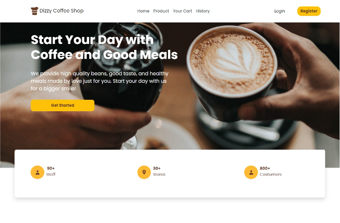
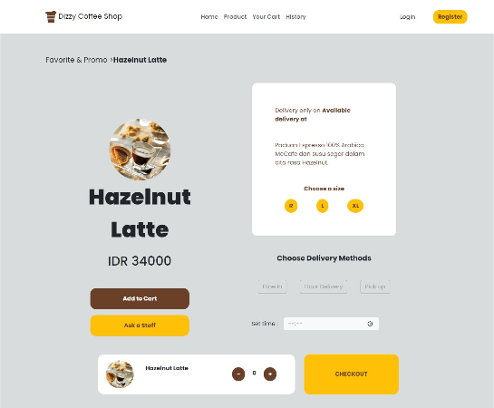
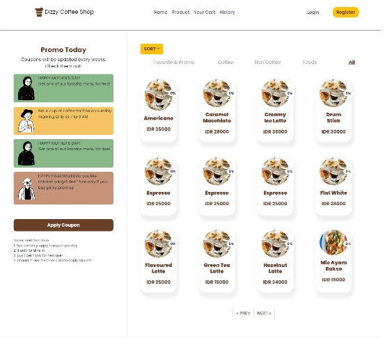
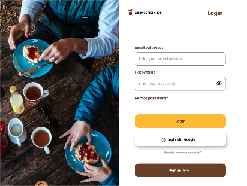

<H1 align="center">FRONT END</H1>

<div align="center">
  
  <h1>DIZZY COFFEE SHOP</h1>

[](https://www.npmjs.com/package/react-router-dom) [](https://www.npmjs.com/package/axios) [](https://www.npmjs.com/package/redux) [](https://www.npmjs.com/package/bootstrap) [](https://www.npmjs.com/package/bootstrap)

<br/>

</div>

Dizzy coffee shop website is a service for order food and beverages. Customer can simply register, login, see products, order, see order history, edit their profile, etc.

## Features

### Public:

- Register
- Login
- Search Products
- Products Detail
- Edit Profile
- Payment or Checkout

### Admin:

- Create Product
- Create Promo
- Update Product
- Update Promo
- Dashboard Admin

## How to Run the Application

### 1. Clone the Repository

Clone this repository by running the following command :

```
$ git clone <this-repo-url>
```

### 2. Install dependency packages

Install dependency packages by run the following code inside project folder:

```
$ npm install
```

OR

```
$ npm i
```

### 3. Set up Project

- Configure .env file

Configure .env file by create file named .env inside project folder and add this line to the file:

<br/>

```
REACT_APP_HOST = "YOUR HOST"
```

- Run Project

Run the app in development mode after server/backend is running. with a command like the following :

```
$ npm run start
```

Open http://localhost:3000 in your browser after project running.

The page will reload when you make changes.\
You may also see any lint errors in the console.

## Deployment

[Netlify deploy link](https://dizzycoffeeshop.netlify.app)

## Screenshots

<div align="center">

</div>
<div align="center">

</div>
<div align="center">

</div>
<div align="center">

</div>

<br/>

# Related Projects

[Dizzy Coffee Shop - Backend](https://github.com/faryadicka/DIZZY-COFFEESHOP-BE)
